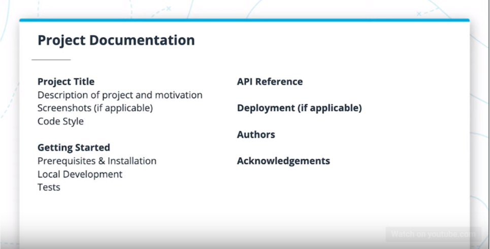

# API Documentation

## [1. Overview](https://classroom.udacity.com/nanodegrees/nd0044/parts/838df8a7-4694-4982-a9a5-a5ab20247776/modules/afbae13a-a91a-4d5e-9f98-4fe13c415f7a/lessons/1de68fcc-5fec-422c-b1a9-69deba3e3d04/concepts/434d8a78-81f5-4ac3-a6a3-5f38d1fe9990)

Now that you've learned the ins and outs of creating a RESTful API, you'll learn about how to make your API accessible and usable for other developers. In this course we will cover:
1. Good vs. Bad API Documentation
2. Practice writing API Documentation
3. Project Documentation

## [2. Documentation Examples](https://classroom.udacity.com/nanodegrees/nd0044/parts/838df8a7-4694-4982-a9a5-a5ab20247776/modules/afbae13a-a91a-4d5e-9f98-4fe13c415f7a/lessons/1de68fcc-5fec-422c-b1a9-69deba3e3d04/concepts/7c126215-d166-485e-826d-a9c65dbad545)

### Google Maps API

### Stripe API

## [3. Best Practices](https://classroom.udacity.com/nanodegrees/nd0044/parts/838df8a7-4694-4982-a9a5-a5ab20247776/modules/afbae13a-a91a-4d5e-9f98-4fe13c415f7a/lessons/1de68fcc-5fec-422c-b1a9-69deba3e3d04/concepts/c1d94a9d-b8cc-424e-8632-2ce4f340c64e)

### Good API documentation
Good API documentation allows any developer considering the API to quickly understand the purpose of the API, the data it works with, and how to send requests and parse the responses. Some documentation, particularly for large projects, even host samples you can run within the documentation to see the API in action. For the purposes of this course, you don't need to implement interactivity, but you will provide examples that can be run by someone viewing your documentation.

Here's a recap (for your reference) of the components that are typically included in good API documentation:

*  Introduction
* Getting Started
    * Base URL
    * API Keys /Authentication (if applicable)
* Errors
    * Response codes
    * Messages
    * Error types
* Resource endpoint library
    * Organized by resource
    * Include each endpoint
    * Sample request
    * Arguments including data types
    * Response object including status codes and data types

## 4. [API Documentation Lab](https://classroom.udacity.com/nanodegrees/nd0044/parts/838df8a7-4694-4982-a9a5-a5ab20247776/modules/afbae13a-a91a-4d5e-9f98-4fe13c415f7a/lessons/1de68fcc-5fec-422c-b1a9-69deba3e3d04/concepts/d3ba679a-0b7e-4fd5-8504-03028ec8ee57)

### Exercise [API Documentation Practice](https://r848940c917260xJUPYTERLrapcyn36.udacity-student-workspaces.com/)

### Solution walkthrough

## 5. [Project Documentation](https://classroom.udacity.com/nanodegrees/nd0044/parts/838df8a7-4694-4982-a9a5-a5ab20247776/modules/afbae13a-a91a-4d5e-9f98-4fe13c415f7a/lessons/1de68fcc-5fec-422c-b1a9-69deba3e3d04/concepts/2f7b248a-6631-42ae-9eef-64075b771cfc)

All good, well-documented projects have a README.md file that should clearly explain the project and how to get started with it to any developers who may want to use or contribute to the project. Depending on your personal style preferences and project type, the structure and exact contents will differ, but the structure below is a good starting place.

* Project Title
    * Description of project and motivation
    * Screenshots (if applicable), with captions
    * Code Style if you are following particular style guides
* Getting Started
    * Prerequisites & Installation, including code samples for how to download all pre-requisites
    * Local Development, including how to set up the local development environment and run the project locally
    * Tests and how to run them
* API Reference. If the API documentation is not very long, it can be included in the README
* Deployment (if applicable)
* Authors
* Acknowledgements

### Project Documentation Screenshot

## 6. [Project Documentation Lab](https://classroom.udacity.com/nanodegrees/nd0044/parts/838df8a7-4694-4982-a9a5-a5ab20247776/modules/afbae13a-a91a-4d5e-9f98-4fe13c415f7a/lessons/1de68fcc-5fec-422c-b1a9-69deba3e3d04/concepts/65277b47-bf8b-4b79-9edd-d54dc566c71d)

### Exercise [API Documentation Practice](https://r848940c917410xJUPYTERLe8g7ukpx.udacity-student-workspaces.com/)

### Solution walkthrough

