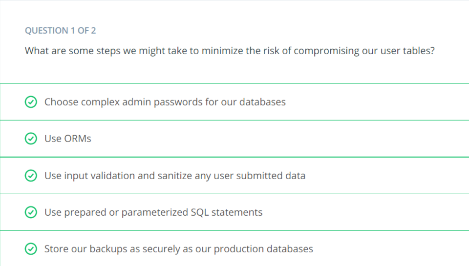
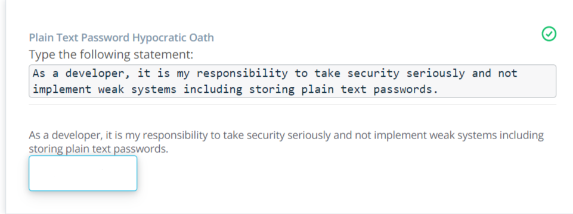
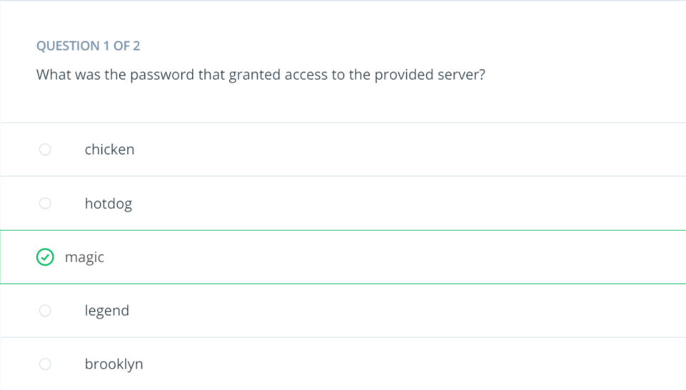
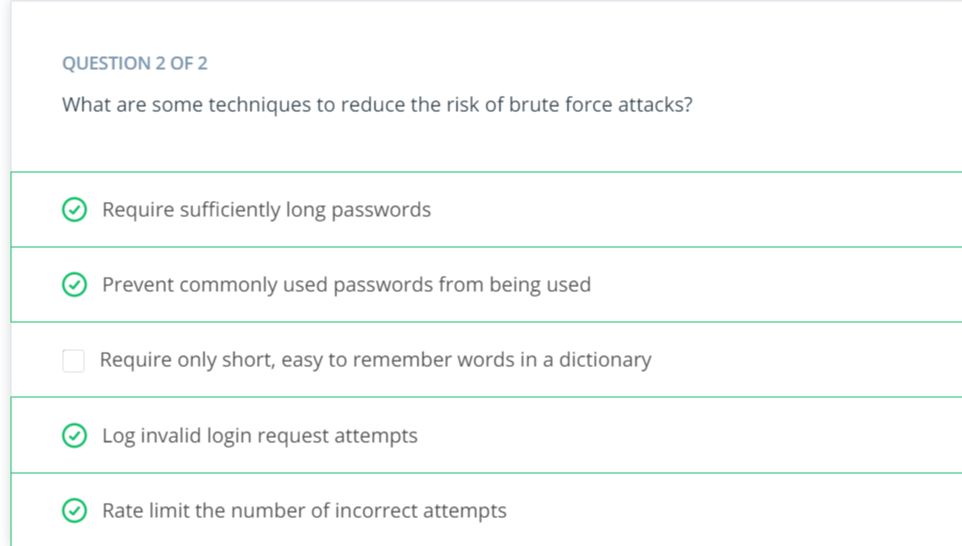
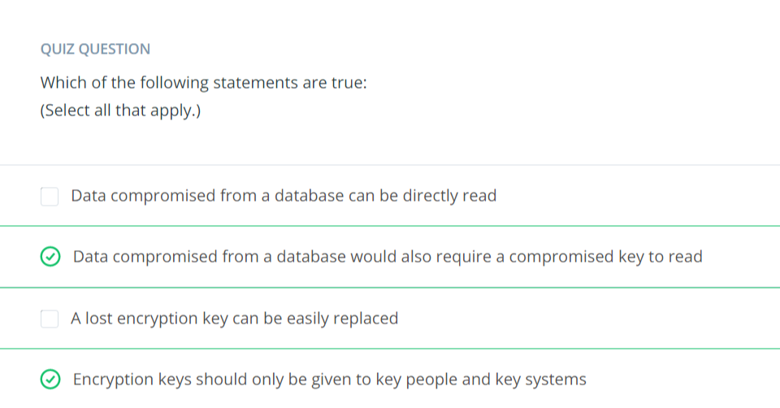
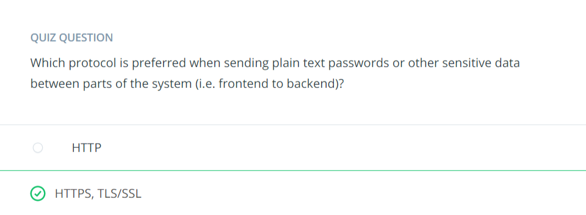
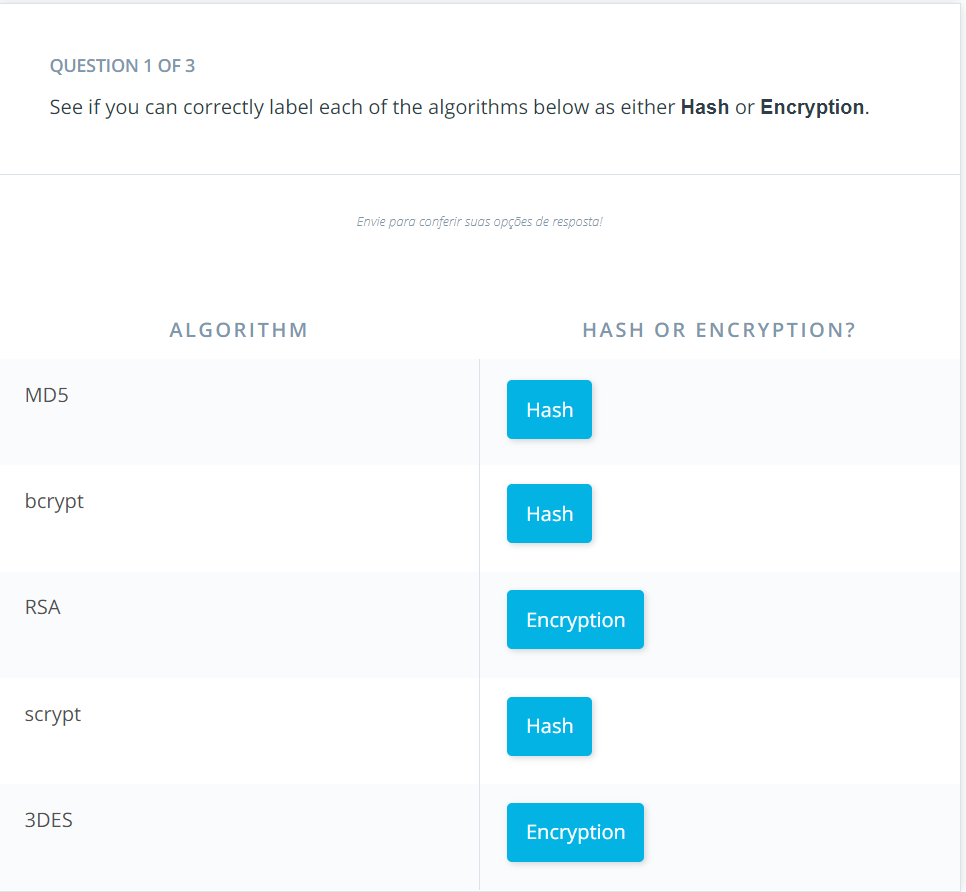
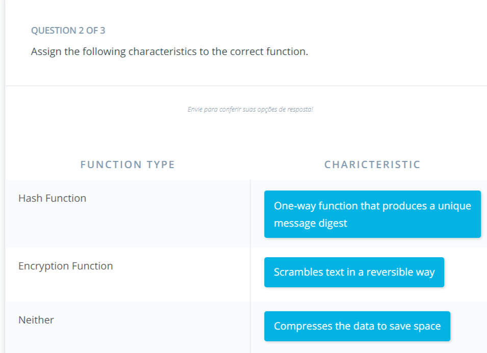
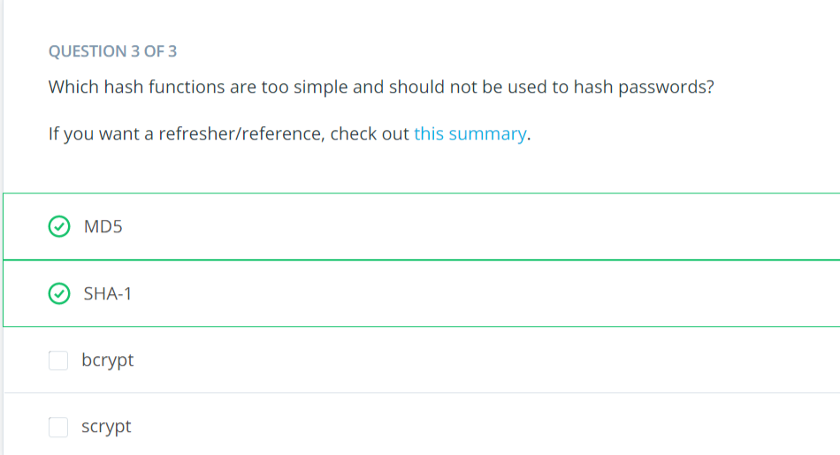
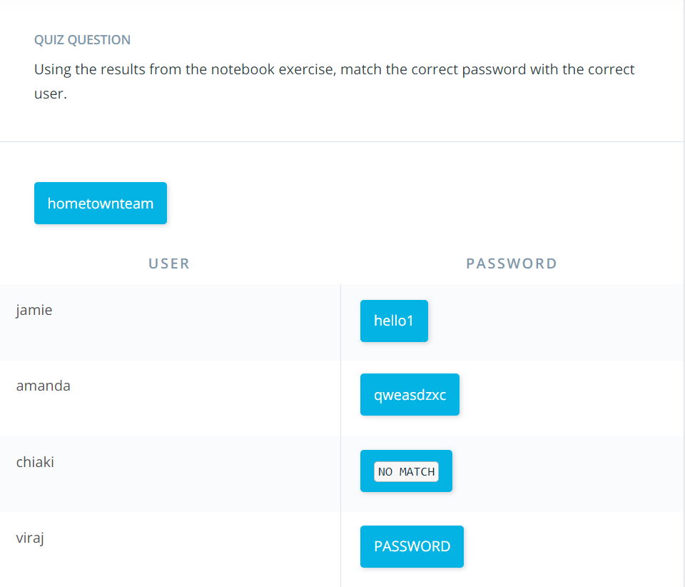

# Passwords

## [01. Lesson Intro](https://classroom.udacity.com/nanodegrees/nd0044/parts/b91edf5c-5a4d-499a-ba69-a598afd9fe3e/modules/5606de9d-aa2b-4a1b-9b14-81b87d80a264/lessons/450352d6-5e7e-47e7-aa41-eae3dc4f3cea/concepts/9a44db7a-9d01-4dc4-b3db-f20914f97931)

### Passwords are ubiquitous and the ABSOLUTE worst.

[](https://youtu.be/kwCEwDPQcRg)

### Lists of common bad passwords

- [WikiPedia List of Lists of Passwords](https://en.wikipedia.org/wiki/List_of_the_most_common_passwords)
- [NIST List and Javascript Library on GitHub](https://github.com/cry/nbp)

## [02. Problems with Plain Text](https://classroom.udacity.com/nanodegrees/nd0044/parts/b91edf5c-5a4d-499a-ba69-a598afd9fe3e/modules/5606de9d-aa2b-4a1b-9b14-81b87d80a264/lessons/450352d6-5e7e-47e7-aa41-eae3dc4f3cea/concepts/f5e2c1a0-c5e6-4b93-8e11-95b859355051)

### Problems with Plain Text

[](https://youtu.be/LN5iiY6H8FU)

### Additional Reading

- Facebook. In March 2019, it was revealed that over 20,000 employees had access to plain text user passwords. Thankfully, it believed there was no malice resulting from this flub up. [Read More](https://www.theverge.com/2019/3/21/18275837/facebook-plain-text-password-storage-hundreds-millions-users).
- Large Power Utility. Discovered in February 2019. They'll conveniently even email you the plain text password. [Read More](https://arstechnica.com/tech-policy/2019/02/plain-wrong-millions-of-utility-customers-passwords-stored-in-plain-text/).
- The site [haveibeenpwned.com](https://haveibeenpwned.com/) has many other documented mistakes and is worth a skim.

### User Table Vulnerability: SQL Injection

[](https://youtu.be/RgxuNyeTq38)

### Questions





### Additional Resources

[Bandit CLI Wargame](https://overthewire.org/wargames/bandit/bandit0.html) - This wargame helps you learn CLI and security while you have fun!

## [03. Problems - Brute Force Attacks](https://classroom.udacity.com/nanodegrees/nd0044/parts/b91edf5c-5a4d-499a-ba69-a598afd9fe3e/modules/5606de9d-aa2b-4a1b-9b14-81b87d80a264/lessons/450352d6-5e7e-47e7-aa41-eae3dc4f3cea/concepts/e186fde6-0c0f-4d1d-8167-32b7012441ef)

### Brute Force Attacks

[](https://youtu.be/SUFrhE_2s9A)

### An Alternative to Rate-Limiting: CAPTCHAs

- Sometimes, rate-limiting or rejecting multiple requests is not the solution
- One unintended consequence would be locking a legitimate user's account because it is under attack
- An alternative is something known as a CAPTCHA
- or "completely automated public Turing test to tell computers and humans apart"
- is designed to be easy for a human but difficult for a machine
- a connection is flat out rejected if a "bot" or script is attempting to gain access through multiple attempts
- One modern implementation of this system that can be added to your site is [Google reCAPTCHA](https://developers.google.com/recaptcha/docs/v3)
- This API produces a score from 0 to 1 of how likely the visitor is a bot based interactions with your site

## [04. Practice - Brute Force](https://classroom.udacity.com/nanodegrees/nd0044/parts/b91edf5c-5a4d-499a-ba69-a598afd9fe3e/modules/5606de9d-aa2b-4a1b-9b14-81b87d80a264/lessons/450352d6-5e7e-47e7-aa41-eae3dc4f3cea/concepts/9a1c6fb0-cbfb-482f-bbf6-937f1eed37a1)

### Practice

[JupyterLab Notebook](https://r848940c859773xJUPYTERLb5n8kexd.udacity-student-workspaces.com/)

### Use the workspace above to answer the following questions





### Final code

> "I accepted the **bonus** challenge and I implemented the code to prevent multiple failed login attempts."

```python
from flask import Flask, request, abort
import hashlib

app = Flask(__name__)

failed_login_attempts = 0

# make a post request
# it should include a json body
# with a password paramater as a string
@app.route('/login', methods=['POST'])
def headers():
    global failed_login_attempts
    data = request.get_json()
    # invalid input format
    if('password' not in data):
        abort(422)
    elif(type(data['password']) is not str):
        abort(422)
    elif(failed_login_attempts == 3):
        abort(429)

    # check password
    # hash the password
    # > this is technically not plain text
    # > you'll learn about hashing soon
    # > we didn't want to make it easy for you to cheat ;)
    digest = hashlib.md5(data['password'].encode()).hexdigest()

    # compare the password to the message digest
    if(digest == '2f3a4fccca6406e35bcf33e92dd93135'):
        return "ACCESS GRANTED"
    else:
        failed_login_attempts += 1
        abort(401)
```

## [05. Problems - Data Handling and Logging](https://classroom.udacity.com/nanodegrees/nd0044/parts/b91edf5c-5a4d-499a-ba69-a598afd9fe3e/modules/5606de9d-aa2b-4a1b-9b14-81b87d80a264/lessons/450352d6-5e7e-47e7-aa41-eae3dc4f3cea/concepts/c1eb762a-73dc-471e-87d0-b0b33c1215e6)

### [Serialization](https://en.wikipedia.org/wiki/Serialization) of Models

- is the process of transforming a data model into a more easily shared format
- is commonly performed when sending information as a response from a server to the requesting client in the form of a JSON object

[](https://youtu.be/h8lGBQ1rS4Q)

### Logging Best Practices

[](https://youtu.be/jKb-vdOT-6U)

### Additional Reading

- [Facebook Logging Plain Text Passwords ](https://www.theverge.com/2019/3/21/18275837/facebook-plain-text-password-storage-hundreds-millions-users)

## [06. Introduction to Encryption](https://classroom.udacity.com/nanodegrees/nd0044/parts/b91edf5c-5a4d-499a-ba69-a598afd9fe3e/modules/5606de9d-aa2b-4a1b-9b14-81b87d80a264/lessons/450352d6-5e7e-47e7-aa41-eae3dc4f3cea/concepts/4c999b32-9b33-44aa-9384-45b1bb46563c)

### What is Symmetric Encryption?

[](https://youtu.be/7ww-sOi05Zs)

### Encryption in the Digital World

[](https://youtu.be/eDGtEvErlSY)

## [07. Using Encryption for User Tables](https://classroom.udacity.com/nanodegrees/nd0044/parts/b91edf5c-5a4d-499a-ba69-a598afd9fe3e/modules/5606de9d-aa2b-4a1b-9b14-81b87d80a264/lessons/450352d6-5e7e-47e7-aa41-eae3dc4f3cea/concepts/7670ed22-fdc1-4607-b77e-70726b06ea71)

### Using Encryption to Secure User Tables

[](https://youtu.be/HXu4bnlRobY)

### Questions



## [08. Practice - Using Cryptography](https://classroom.udacity.com/nanodegrees/nd0044/parts/b91edf5c-5a4d-499a-ba69-a598afd9fe3e/modules/5606de9d-aa2b-4a1b-9b14-81b87d80a264/lessons/450352d6-5e7e-47e7-aa41-eae3dc4f3cea/concepts/5adc5ff8-1728-4163-9271-9db65ba1089c)

### Using the Cryptography Python Package

Python has a useful package called **Cryptography** that implements encryption for us. We've given you some example code in a notebook below and enough information to answer the questions following the notebook. If you get stuck, refer to the [package documentation](https://cryptography.io/en/latest/).

[Jupyter Notebook](https://r848940c858541xJUPYTERqdhs1cm1.udacity-student-workspaces.com/notebooks/Fernet_Encryption.ipynb)

### Questions

For the following exercises you should use this key:

> `key=b'8cozhW9kSi5poZ6TWFuMCV123zg-9NORTs3gJq_J5Do='`

#### Decode the Following Message

Use the included notebook and key above to decode this message:


> `message = b'gAAAAABc8Wf3rxaime-363wbhCaIe1FoZUdnFeIXX_Nh9qKSDkpBFPqK8L2HbkM8NCQAxY8yOWbjxzMC4b5uCaeEpqDYCRNIhnqTK8jfzFYfPdozf7NPvGzNBwuuvIxK5NZYJbxQwfK72BNrZCKpfp6frL8m8pdgYbLNFcy6jCJBXATR3gHBb0Y='`

**Answer**

> b'great job! remember, encryption is only as good as your key secrecy!'

#### Encrypt a String

Use the included notebook and key above to encrypt this message:

> `message = b'encrypting is just as useful'`

**Answer**

> gAAAAABepY_saTiKoE0paJ3w2yI9_x5_b2KuQ9ki8zgigCHCAz9zmN8gdJt63LV-puo4UWPuUrCISX8E7H1W8CBq5DgE7-504dccwRYq2JlSSFsZwWUVv88=

### Additional Resources (Extra curricular)

- [CRYPTO101](https://www.crypto101.io/)
- [the cryptopals crypto challenges](https://cryptopals.com/)

## [09. Asymmetric Encryption](https://classroom.udacity.com/nanodegrees/nd0044/parts/b91edf5c-5a4d-499a-ba69-a598afd9fe3e/modules/5606de9d-aa2b-4a1b-9b14-81b87d80a264/lessons/450352d6-5e7e-47e7-aa41-eae3dc4f3cea/concepts/26656da6-b2ac-41a3-913c-aaf5e5d3c5d0)

### Asymmetric Encryption

[](https://youtu.be/tRf2mE_ABjc)

### Question



## [10. Hashing](https://classroom.udacity.com/nanodegrees/nd0044/parts/b91edf5c-5a4d-499a-ba69-a598afd9fe3e/modules/5606de9d-aa2b-4a1b-9b14-81b87d80a264/lessons/450352d6-5e7e-47e7-aa41-eae3dc4f3cea/concepts/a9f2df0f-14b7-4d6c-a672-61ac128f530e)

### What is Hashing?

[](https://youtu.be/SunuuBA97z8)

### Questions





### Using Hashing to Secure Our User Tables

[](https://youtu.be/lXkHzOveQm4)

### Questions



### Additional Resources

- [Wikipedia hash function security summary](https://en.wikipedia.org/wiki/Hash_function_security_summary).
- [Making a Faster Cryptanalytic Time-Memory Trade-Of](https://lasec.epfl.ch/pub/lasec/doc/Oech03.pdf) - Original paper first describing and naming Rainbow Tables!

## [11. Practice - Rainbow Tables](https://classroom.udacity.com/nanodegrees/nd0044/parts/b91edf5c-5a4d-499a-ba69-a598afd9fe3e/modules/5606de9d-aa2b-4a1b-9b14-81b87d80a264/lessons/450352d6-5e7e-47e7-aa41-eae3dc4f3cea/concepts/c24c53a6-4388-451d-aa1a-9a254a8b09bc)

### Generate Rainbow Tables using the hashlib MD5 Package

If you get stuck, refer to the [hashlib documentation](https://docs.python.org/3/library/hashlib.html).

[Jupyter Notebook](https://r848940c858541xJUPYTERqdhs1cm1.udacity-student-workspaces.com/notebooks/Rainbow_Tables.ipynb)

#### My solution

```python
# I use dict comprehension to transform each password to another
# dict of { hash : plaintext }
rainbow_table = {
    hashlib.md5(bad_password.encode()).hexdigest(): bad_password
        for bad_password in nist_bad
}

# Just printing to see some result
print(list(rainbow_table.items())[1:10])

# I iterate over the keys of the dict
for user in leaked_users_table:
    # I get the value correspond to this key and then get only the md5 value
    md5 = leaked_users_table[user]['md5']

    # I get the plaintext of the corresponding hash from the
    # rainbow table or None
    found = rainbow_table.get(md5)
    if found:
        print(f'Found user {user}: \t {md5} \t {found}')
```

#### Their solution

```python
# RAINBOW TABLE SOLUTION
rainbow_table = {}
for word in nist_bad:
    hashed_word = hashlib.md5(word.encode()).hexdigest()
    rainbow_table[hashed_word] = word

# Use the Rainbow table to determine the plain text password
for user in leaked_users_table.keys():
    try:
        print(user + ":\t" + rainbow_table[leaked_users_table[user]['md5']])
    except KeyError:
        print(user + ":\t" + '******* hash not found in rainbow table')
```

### Questions



## [XX. ]()

### SECTION

[](https://youtu.be/VIDEO)

## [XX. ]()

### SECTION

[](https://youtu.be/VIDEO)

## [XX. ]()

### SECTION

[](https://youtu.be/VIDEO)

## [XX. ]()

### SECTION

[](https://youtu.be/VIDEO)
